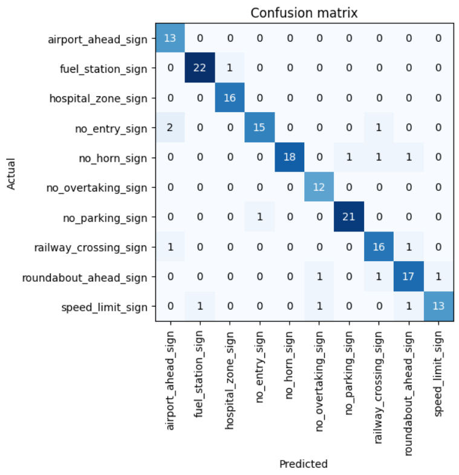
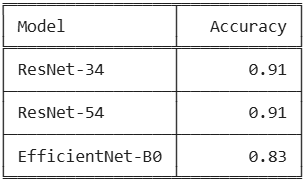
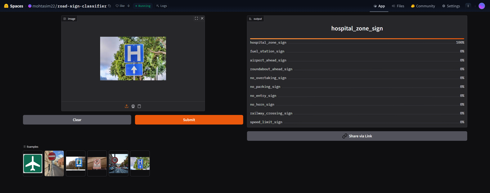
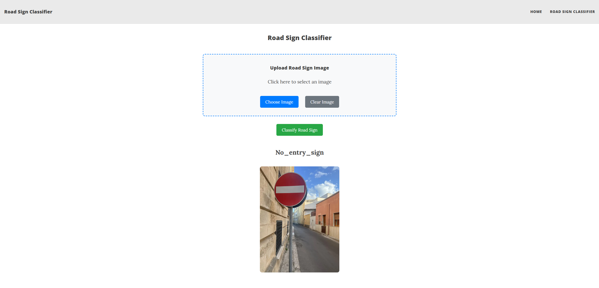

# Road-Sign-Classifier
## Project Overview  

An image classification model that leverages data collection, augmentation, model training, dataset cleaning, deployment, and API integration to recognize different types of road signs from images using deep learning. The Signs are :

1. Stop
2. Speed Limit
3. No Entry
4. No Parking
5. No Overtaking
6. No Horn
7. Railway Crossing
8. Roundabout Ahead
9. Fuel Station
10. Tunnel Ahead 


## Data Collection & Preprocessing
   - A total of 1,905 images were collected using DuckDuckGo Image Search, covering 10 types of road signs
   - Each sign is assigned to its own folder in the [data/](./data/) directory
   - All downloaded images were checked to ensure they were valid and not corrupted
   - Any failed images detected during verification were automatically removed from the dataset 
   - DataBlock is created to organize the dataset by images and their corresponding labels
   - The dataset is split into 90% training and 10% validation
   - Initial image resize: **128×128 pixels**.
   - Final augmentation resize: **224×224 pixels**.
   
## Data Augmentation
- Data augmentation is applied to  make the model more robust and improve generalization.
- Images are resized to 224×224 for consistent input size.
- Small rotations, zoom, and lighting changes are applied to simulate real-world variations.
- Vertical flipping is disabled since road signs never appear upside down.
- Affine transformations are applied with a high probability to improve generalization.

 After cleaning and removing failed images,the final dataset has 1,815 images of 10 different classes. Details on data preparation can be found [here](./notebooks/data_prep.ipynb) 
 
## Training and Data Cleaning
- The model is trained using ResNet34 as base model and fine tuned for 5 epochs. After data cleaning the model is retrained for 3 epochs achieving accuracy of 91%
- Two other models: ResNet50, EfficientNet B0 are used for comparison. 
- ResNet-34 performed best in our case because its capacity allows it to learn complex patterns effectively, even from a relatively small dataset, while remaining stable and less prone to underfitting compared to the other models.

### Confusion Matrix for ResNet-34 Model   
   <p align="center">
     
   </p> 
   <p align="center">
  <em> Confusion Matrix for ResNet-34 Model</em>
  </p>
   
### Model Comparison
Two additional models— ResNet50, EfficientNet B0 — were also trained and evaluated. However, ResNet-34 achieved the best overall performance.
   <p align="center">
     
   <p align="center">
  <em>Accuracy comparison across ResNet-34, ResNet50 and EfficientNet B0</em>
  </p>
	   
Details can be found from [Training and Data Cleaning Notebook](./notebooks/training_and_data_cleaning.ipynb)

## Model Deployment
The model is deployed to HuggingFace Spaces Gradio App. The implementation can be found in [deployment folder](./deployment) or [here](https://huggingface.co/spaces/mohtasim22/road-sign-classifier)

### Recognizing Machu Picchu
<p align="center">
	

## API integration with GitHub Pages
The deployed model API is integrated [here](https://mohtasim22.github.io/Road-Sign-Classifier/road_sign_classifier.html/) in GitHub Pages Website. Implementation and other details can be found in [docs](./docs) folder.

### Recognizing Palace Of Versailles via API
<p align="center">
     
   <p align="center">  
  </p>

## Build from Source
### Clone the repo
```bash
git clone https://github.com/mohtasim22/Road-Sign-Classifier.git
cd Road-Sign-Classifier
```
### Initialize and activate virtual environment
```bash
python -m venv venv
venv\Scripts\activate 
```
### Installing PyTorch 
**GPU installation :**
```bash
pip3 install torch torchvision torchaudio --index-url https://download.pytorch.org/whl/cu121
```
Replace cu121 with the CUDA version that matches your system.

 **CPU-only installation**
```bash
pip3 install torch torchvision torchaudio
```
### Verifying PyTorch device
Run the following code to verify installation
```bash
import torch

print(torch.cuda.is_available())
```
If the output is True, then PyTorch is successfully set up to use the GPU.

### Install Other Dependencies
```bash
pip3 install fastai fastbook nbdev gradio
```
